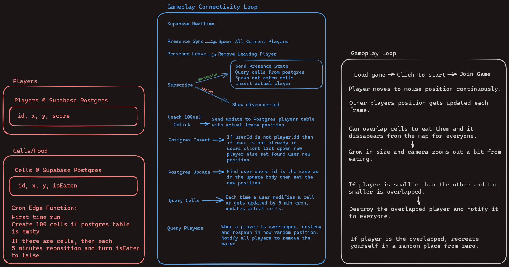

# Phaser JS Agario Clone that uses Supabase Realtime.

This is a Phaser 3 project web game that uses Vite for bundling. It supports hot-reloading for quick development workflow and includes scripts to generate production-ready builds. Also includes Supabase backend realtime connectivity with postgres and edge functions using Deno.

### Versions

- [Phaser 3.80.1](https://github.com/phaserjs/phaser)
- [Vite 5.1.4](https://github.com/vitejs/vite)
- [Supabase 2.39.7](https://github.com/supabase/supabase-js)
- [uuid 9.0.1](https://github.com/uuidjs/uuid)



## Requirements

[Node.js](https://nodejs.org) is required to install dependencies and run scripts via `npm`.

#### For Deploying Edge Functions to Supabase

This is necessary for creating the cells/food for players to eat.

[Supabase CLI](https://supabase.com/docs/guides/cli/getting-started) is required to login and deploy the functions to supabase, run them from supabase folder, consider this is my `settings.json` if using vscode:

```
{
  "deno.enablePaths": [
    "supabase/functions"
  ],
  "deno.lint": true,
  "deno.unstable": true,
  "[typescript]": {
    "editor.defaultFormatter": "esbenp.prettier-vscode"
  }
}
```

## Available Commands

| Command | Description |
|---------|-------------|
| `npm install` | Install project dependencies |
| `npm run dev` | Launch a development web server |
| `npm run build` | Create a production build in the `dist` folder |

## Writing Code

After cloning the repo, run `npm install` from your project directory. Then, you can start the local development server by running npm run dev`.

The local development server runs on `http://localhost:8080` by default. Please see the Vite documentation if you wish to change this, or add SSL support. 
Modified to run over your actual network so you can visit the ip-address:8080 on another device and play. If you do *NOT* want this to happen remove from `package.json` script for dev the `--host` flag

Once the server is running you can edit any of the files in the `src` folder. Vite will automatically recompile your code and then reload the browser.

## Project Structure

We have provided a default project structure to get you started. This is as follows:

- `index.html` - A basic HTML page to contain the game.
- `src` - Contains the game source code.
- `src/main.js` - The main entry point. This contains the game configuration and starts the game.
- `src/broadcast.js` - Contains the Supabase client and room initialization.
- `src/scenes/` - The Phaser Scenes are in this folder.
- `src/objects/` - The Phaser Objects/Entities are in this folder.
- `public/style.css` - Some simple CSS rules to help with page layout.
- `public/assets` - Contains the static assets used by the game.

When you issue the `npm run build` command, all static assets are automatically copied to the `dist/assets` folder.

## Deploying to Production

After you run the `npm run build` command, your code will be built into a single bundle and saved to the `dist` folder, along with any other assets your project imported, or stored in the public assets folder.

In order to deploy your game, you will need to upload *all* of the contents of the `dist` folder to a public facing web server.

## Customizing the Template

### Vite

If you want to customize your build, such as adding plugin (i.e. for loading CSS or fonts), you can modify the `vite/config.*.mjs` file for cross-project changes, or you can modify and/or create new configuration files and target them in specific npm tasks inside of `package.json`. Please see the [Vite documentation](https://vitejs.dev/) for more information.

## Join the Phaser Community!

We love to see what developers like you create with Phaser! It really motivates us to keep improving. So please join our community and show-off your work 😄

**Visit:** The [Phaser website](https://phaser.io) and follow on [Phaser Twitter](https://twitter.com/phaser_)<br />
**Play:** Some of the amazing games [#madewithphaser](https://twitter.com/search?q=%23madewithphaser&src=typed_query&f=live)<br />
**Learn:** [API Docs](https://newdocs.phaser.io), [Support Forum](https://phaser.discourse.group/) and [StackOverflow](https://stackoverflow.com/questions/tagged/phaser-framework)<br />
**Discord:** Join us on [Discord](https://discord.gg/phaser)<br />
**Code:** 2000+ [Examples](https://labs.phaser.io)<br />
**Read:** The [Phaser World](https://phaser.io/community/newsletter) Newsletter<br />
